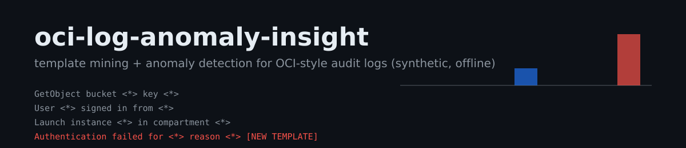

<p align="center">
  
</p>

# oci-log-anomaly-insight

Offline **log template mining and anomaly detection** for OCI Audit-style
event streams. A simplified Drain parser (He et al., ICWS 2017) distills raw
messages into templates, a windowed detector flags new and spiking patterns,
and an incident summarizer writes a severity-rated report where **every claim
cites concrete event indices** from the source stream.

> **Portfolio notice.** This is an engineering portfolio project. All logs
> are **synthetically generated** (deterministic seeds, OCI Audit event
> shape). It has **not** been run against OCI Logging or a live tenancy, and
> no detection claims are made beyond the reproducible evaluation below.
> The pipeline accepts real audit exports if converted to the same message
> list shape.

## What it does

- **Synthetic audit stream** - normal background traffic (sign-ins,
  instance launches, object storage, database and network events) with
  injectable incident windows: credential stuffing and destructive actions.
- **Drain-style template mining** - groups by length and first token,
  generalizes divergent positions to `<*>`. 2,000 events distill to 7
  templates.
- **Anomaly detection** - two explainable signals: `new-template`
  (never seen in baseline) and `rate-spike` (>5x baseline rate in a
  window). On the built-in stream the injected incident is isolated to
  exactly its true cluster: **recall 1.0, zero false-positive clusters**
  (asserted in CI as an eval gate).
- **Cited incident reports** - headline, severity, and evidence lines that
  reference event indices, so a reviewer can verify every claim.

## Quickstart

```bash
pip install -e .
python -m log_anomaly                              # full pipeline, JSON out
python -m log_anomaly --incident destructive-actions
python -m log_anomaly --incident none              # clean stream, no anomalies
```

Example report on the built-in stream:

```json
{
  "headline": "Suspicious new log pattern: 'Authentication failed for <*> reason <*>' (10 events in one window)",
  "severity": "high",
  "evidence": ["Template first appeared at t=41400s with no baseline occurrence (events 1400-1404 cited).", ...]
}
```

## Design

| Module | Role |
| --- | --- |
| `synth.py` | Deterministic OCI Audit-style event generator + incident injection |
| `drain.py` | Simplified Drain template miner |
| `detect.py` | Windowed new-template / rate-spike detection |
| `report.py` | Severity + evidence with event-index citations |
| `cli.py` | Pipeline entry point, JSON output |

## Tests and CI

12 tests cover determinism, template merging, both incident scenarios, the
clean-stream case, citation integrity, and a detection **eval gate**
(incident cluster must be found with no false-positive clusters). CI runs
the suite on Python 3.10-3.12 plus a CLI smoke check.

## Roadmap

See the open issues: parsing real OCI Audit JSON exports and sliding-window
performance for million-event streams.

## License

MIT
